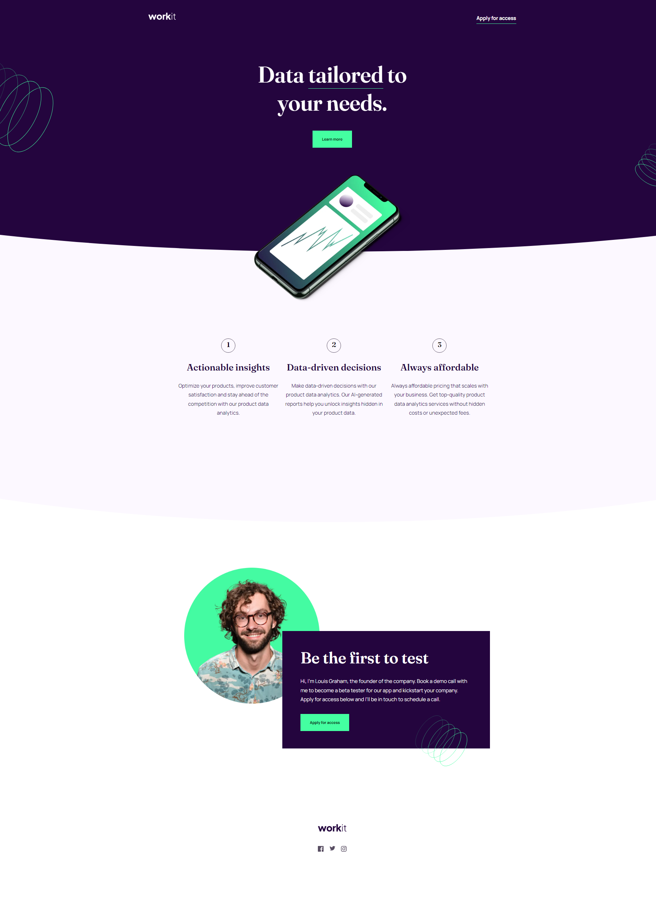

# Frontend Mentor - Workit landing page solution

This is a solution to the [Workit landing page challenge on Frontend Mentor](https://www.frontendmentor.io/challenges/workit-landing-page-2fYnyle5lu). Frontend Mentor challenges help you improve your coding skills by building realistic projects. 

## Table of contents

- [Overview](#overview)
  - [The challenge](#the-challenge)
  - [Screenshot](#screenshot)
  - [Links](#links)
- [My process](#my-process)
  - [Built with](#built-with)
  - [What I learned](#what-i-learned)
  - [Continued development](#continued-development)
  - [Useful resources](#useful-resources)
- [Author](#author)
- [Acknowledgments](#acknowledgments)

## Overview

### The challenge

Users should be able to:

- View the optimal layout for the interface depending on their device's screen size
- See hover and focus states for all interactive elements on the page

### Screenshot

### Links

- Solution URL: [Add solution URL here](https://your-solution-url.com)
- Live Site URL: [Add live site URL here](https://your-live-site-url.com)

## My process

### Built with

- Semantic HTML5 markup
- CSS custom properties
- Flexbox

### What I learned

I feel like I learned how to structure an html and css page the right way.

I just feel kind of disappointed in myself for having done something, in my mind, wrong.
If you notice, the background with curved border was made with a width of 200%, I had to remove the horizontal bar from the page for it not to appear.

Another mistake I feel like I made, was not having the right proportions on the page.

### Continued development

I intend to do 2 more short projects, however this time using Javascript to implement a feature.
After these, I will practice my ReactJS with small projects.

## Author

- Website - [Rickras](https://github.com/Rickrasin/Rickrasin)
- Frontend Mentor - [@yourusername](https://www.frontendmentor.io/profile/Rickrasin)
- Twitter - [@yourusername](https://www.twitter.com/ricksoninho)

## Acknowledgments

 I am especially grateful to my current job HTS and coordinator, as they allow me time to develop my programming skills in my free time at work.